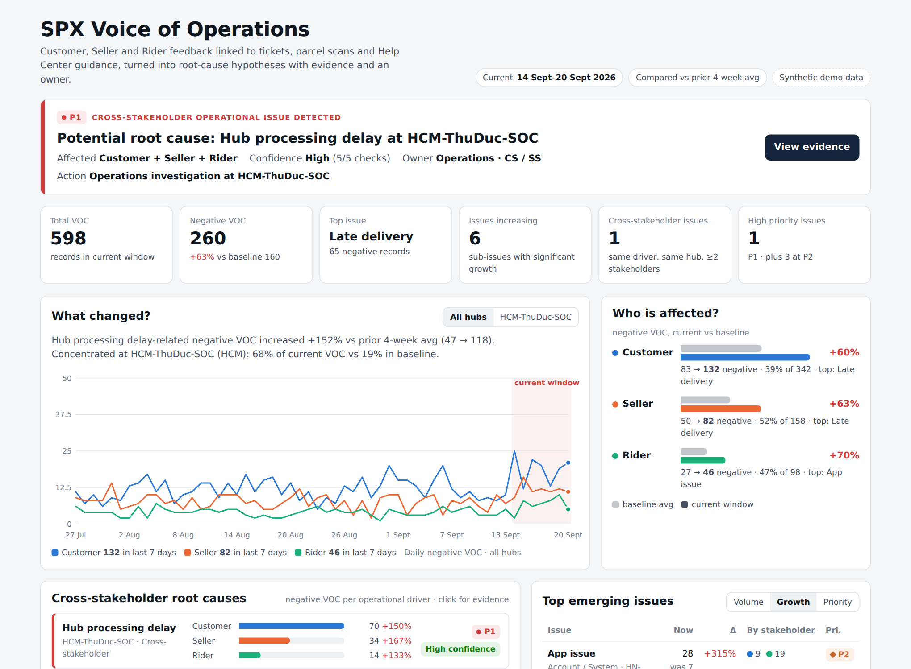
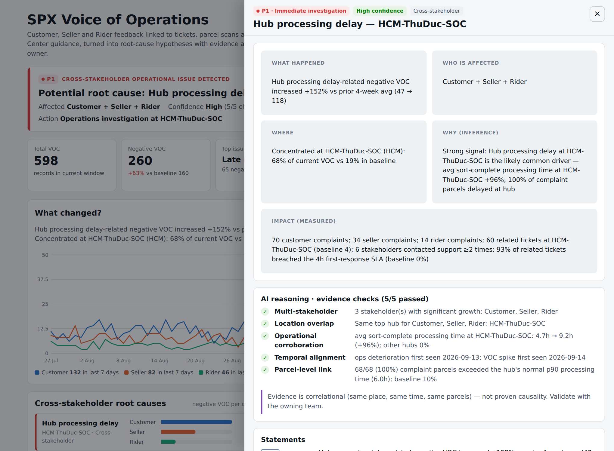

# SPX Voice of Agent

**An AI operations-intelligence agent that connects feedback from Customers, Sellers and Riders with
support tickets, parcel-level operational events and Help Center knowledge — and turns it into
cross-stakeholder root-cause hypotheses with evidence, an owner and a recommended action.**

> Codex Hackathon SEA 2026 submission · all data is synthetic · no production data, PII or secrets.

```
Raw VOC ─► structured signals ─► cross-stakeholder pattern detection ─► root-cause analysis ─► recommended action
```

It is **not** a chatbot, **not** a sentiment tool and **not** a dashboard-only project.
The differentiator is **cross-stakeholder root-cause analysis**: when buyers complain about late parcels,
shops complain about stuck order status and riders complain about waiting at the hub — in the same place,
at the same time — the agent recognises one operational driver, checks it against operational data,
and routes it to the team that can fix it.



## Quick start

```bash
pip install -r requirements.txt
python run_local.py --mode demo        # one command: data → classification → root cause → dashboard + reports
python app.py                          # optional: open the dashboard on http://localhost:8000
python -m pytest -q                    # 39 tests
```

Console output of the demo:

```
==============================================================================
  ⚠  CROSS-STAKEHOLDER OPERATIONAL ISSUE DETECTED
==============================================================================
  Potential root cause : Hub processing delay (HCM-ThuDuc-SOC)
  Confidence / priority: High (5/5 checks) · P1 Immediate investigation
  Affected             : Customer +150% · Seller +167% · Rider +133%
  Ops signal           : avg sort-complete processing time @ HCM-ThuDuc-SOC: 4.7 → 9.21 (+96%)
  Action [Operations]  : Operations investigation at HCM-ThuDuc-SOC: check inbound volume vs sorting capacity, ...
  Action [CS / SS   ]  : CS/SS communication update: proactive delay notice to affected buyers and shops ...
  Action [Operations]  : Rider dispatch: stagger rider check-in at HCM-ThuDuc-SOC until processing time is back ...
  Note                 : correlational evidence — 'likely driver', not proven causality
==============================================================================
```

## What the agent answers

| Question | Where |
|---|---|
| What changed? | Trend by stakeholder, current window vs baseline |
| Who is affected? | Customer / Seller / Rider breakdown |
| Where is the problem? | Region / hub concentration and lift vs baseline |
| Which issue is increasing? | Top emerging issues (sort by volume, growth, priority) |
| What is the likely root cause? | Root-cause hypothesis + 5 named evidence checks |
| Is the same root cause hitting Customer, Seller and Rider? | Cross-stakeholder root-cause panel |
| Which team should investigate? What action? | Owner + recommended actions + action list |

## Architecture

Adapted from the [VOC Root-Cause Agent](https://github.com/nguyenngocvantrinh-nasha/voc-root-cause-agent-clawathon-2026)
(Data Cleaner → Journey/Ticket Mapper → VOC Classifier → Root Cause Analyzer → Report Generator), redesigned
for logistics and three stakeholders. Full reasoning in **[ARCHITECTURE_SPX.md](ARCHITECTURE_SPX.md)**.

| Module | Role |
|---|---|
| `spx_voo/data_loader.py` | Read + schema-validate the 6 CSVs |
| `spx_voo/data_cleaner.py` | Unify Customer/Seller/Rider VOC, types, dedupe, data-quality stats |
| `spx_voo/linker.py` | VOC ↔ parcel journey (`tracking_id`), VOC ↔ tickets (stakeholder, ±2 days) |
| `spx_voo/text_utils.py` | Vietnamese normalisation: accents, teen code (`ko`, `dc`, `ship`), stretched letters, fuzzy typos |
| `spx_voo/voc_classifier.py` | **Layer 1** rules on 100 % of records → group, sub-issue, secondary issues, priority, owner, confidence, matched signal, reason, review flag |
| `spx_voo/llm_classifier.py` | **Layer 2** LLM only for low-confidence / conflicting / multi-issue records; output validated against the taxonomy, else rule label kept |
| `spx_voo/cross_stakeholder_analyzer.py` | Per operational driver: stakeholder growth, hub concentration, ops metric at hub vs control hubs, parcel-level link, temporal alignment, ticket/SLA signals |
| `spx_voo/root_cause_analyzer.py` | 5 evidence checks → confidence → correlation-safe wording → explained P1/P2/P3 |
| `spx_voo/knowledge_checker.py` | Help Center: missing article, article does not explain, outdated; share of complaints asking the unanswered question |
| `spx_voo/insight_generator.py` | What / Who / Where / Why / Impact / Action / Owner / Priority / Evidence, every sentence tagged FACT · INFERENCE · RECOMMENDATION |
| `spx_voo/action_generator.py` | Action list |
| `spx_voo/dashboard.py`, `report_generator.py` | Self-contained HTML dashboard with drill-down; daily / weekly / monthly reports; CSV/XLSX action list |
| `config/*.yaml` | Taxonomy, operational drivers, priority weights, Vietnamese normalisation — **business logic lives in config, not code** |

### Cross-stakeholder root-cause engine

For each operational driver in `config/drivers.yaml` (hub processing delay, last-mile failure, pickup capacity,
payout, app stability, support responsiveness, parcel integrity):

| Check | Passes when |
|---|---|
| Multi-stakeholder | ≥ 2 stakeholders show significant growth |
| Location overlap | Those stakeholders point at the same top hub |
| Operational corroboration | Ops metric at that hub worsens ≥ 20 % **while other hubs (control group) stay flat** |
| Temporal alignment | Operational deterioration starts on/before the VOC spike |
| Parcel-level link | ≥ 40 % of complaint parcels exceeded the hub's normal p90 processing time |

Confidence: **High** ≥ 4 checks · **Medium** 2–3 · **Low** ≤ 1. Low confidence is never P1.
Wording follows confidence: *"strong signal … likely driver"* → *"potential root cause"* → *"possible driver, needs validation"*.
The agent never writes "caused by".



### Hybrid classification

* Rules classify every record (accuracy on the synthetic labelled set: **~94 %** primary sub-issue).
* Only ~5 % of records are flagged for the LLM (`low_confidence`, `dropdown_text_conflict`, `multi_issue`).
* LLM output outside the taxonomy, malformed JSON, timeouts → the rule label is kept (`llm_status` records why).

```bash
# Layer 2 with any OpenAI-compatible endpoint
export LLM_PROVIDER=openai LLM_API_KEY=sk-... LLM_MODEL=gpt-4o-mini   # LLM_BASE_URL optional
python run_local.py --mode demo

# Offline: deterministic stub that exercises gating / validation / fallback (not a model)
python run_local.py --mode demo --llm mock
```

## Data (synthetic)

`scripts/generate_synthetic_data.py` (seeded, deterministic) writes `data/synthetic/`:
`customer_voc.csv`, `seller_voc.csv`, `rider_voc.csv`, `support_tickets.csv`, `operational_events.csv`,
`help_center.csv` (+ `_ground_truth.csv` used only to measure classifier accuracy). 27 Jul – 20 Sep 2026,
7 fictional hubs, Vietnamese comments with/without accents, typos, teen code and multi-issue sentences.

Embedded stories:

| | Story | Expected output |
|---|---|---|
| **A** | `HCM-ThuDuc-SOC` processing delay from 14 Sep (ops deteriorates on 13 Sep) | **P1 cross-stakeholder, High confidence, Customer + Seller + Rider → Operations investigation** |
| B | Sellers ask what happens after 2 failed delivery attempts; article HC-004 doesn't say | **Knowledge gap → Update Help Center** (owner SS) |
| C | Background COD / settlement complaints with no ops signal | Low-confidence trend, never escalated to P1 |
| D | Rider app login spike in `HN-LongBien-SOC` | Emerging trend, owner Product, not merged into the hub story |

## Outputs (`outputs/`, git-ignored)

| File | Content |
|---|---|
| `SPX_Voice_of_Operations_Dashboard.html` | Main dashboard with drill-down (open offline) |
| `SPX_Daily_Operations_Intelligence_YYYYMMDD.html` | Today vs prior 7-day avg + issues still active from the 7-day view |
| `SPX_Weekly_VOC_Root_Cause_Report_YYYYWww.html` | Last 7 days vs prior 4-week average |
| `SPX_Monthly_Operations_Intelligence_YYYYMM.html` | Last 28 days vs prior 28 days + hub × stakeholder matrix |
| `SPX_Action_List.csv / .xlsx` | insight, root_cause, stakeholder, priority, owner, recommended_action, evidence, status |
| `voc_classified.csv` | Every record with its label, matched signal, reason and LLM status (traceability) |
| `insights.json` | Machine-readable insights with evidence and record ids |

## Principles

* **Evidence-based and traceable** — every insight lists metrics, source files and the record / ticket ids behind them.
* **Observed fact vs AI inference vs recommendation** are labelled separately.
* **Deterministic where business rules apply**; LLM only where it adds value.
* **No invented impact** — impact cites counted complaints, tickets, repeat contacts and SLA breach only.

## Out of scope

Authentication, real SPX integrations, real customer data, microservices, real-time infrastructure.
This is a hackathon MVP.
